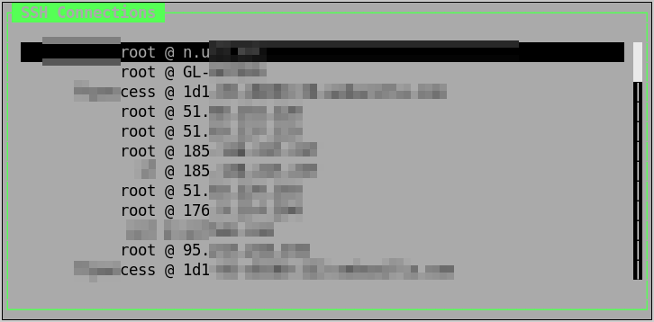

# SSH Menu

SSH Menu is a Perl-based utility that leverages your `.bash_history` and SSH configuration files in `$HOME/.ssh/` to provide a convenient user interface for managing and initiating SSH connections. It automatically parses your history and SSH configuration to prioritize frequently used connections, making it easier to access your most important servers.

## Features

- Easy-to-use interface for selecting SSH connections.
- Integration with `.bash_history` to remember and prioritize frequently used connections.
- Support for both SSH and Mosh (Mobile Shell) connections.
- Customizable hotkeys for quick access to functionality.

## Hotkeys

- `Q`, `q`, or `Ctrl+Q`: Exit the SSH Menu.
- `Enter`: Connect to the selected SSH connection.
- `M`: Enable Mosh for the current session.
- `S`: Disable Mosh for the current session.

## Screenshot



## Usage

It's convenient to bind the SSH Menu to a hotkey using your X11 window manager. This allows you to quickly open the menu with a keyboard shortcut.

## Installation

### Dependencies

Before installing SSH Menu, ensure you have Perl and the necessary Perl modules installed on your system. You can install Curses::UI Perl module using CPAN:

```bash
cpan Curses::UI
```

### Install SSH Menu

To install SSH Menu, run the following commands:

```bash
mkdir -p $HOME/.local/bin
curl -o $HOME/.local/bin/ssh-menu https://raw.githubusercontent.com/azazar/ssh-menu/master/ssh-menu
chmod +x $HOME/.local/bin/ssh-menu
```

Ensure that `$HOME/.local/bin` is in your PATH so that you can run `ssh-menu` from anywhere.

## License

SSH Menu is licensed under the GNU General Public License v3.0 (GPLv3). The full text of the license will be added to the project separately.
